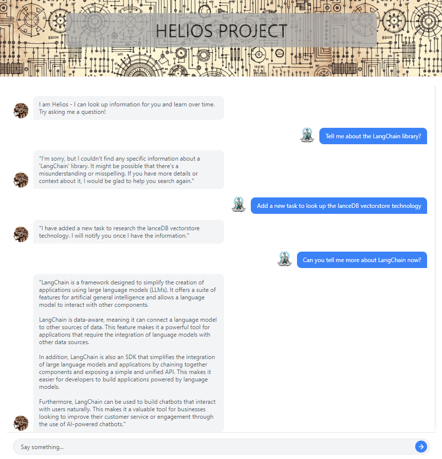

# Helios Chatbot

## Description

Helios is a self-evolving chatbot powered by GPT-4, designed to enhance its understanding over time by conducting background research tasks for unknown queries. It leverages a local knowledge base and various external search tools to provide accurate and informative responses. Additionally, Helios offers a PDF loader feature for enterprise or corporate users to extract and utilize information from PDF documents.

Helios is a proof-of-concept: the idea here is to show how powerful a few lines of python and access to wikipedia can be. When you mix in asynchronous processing and an ability to load your own data, you get a rapidly customisable solution that can adapt to many problem domains. To see how we've used this approach with our other enterprise clients to solve real world challenges, get in touch at https://latrobe.group

## Technologies

- **GPT-4:** Utilized for handling conversations and performing various tasks.
- **Langchain:** An open-source framework simplifying the creation of applications using large language models, aiding in document analysis, summarization, and chatbot functionalities.
- **FastAPI:** Used for handling HTTP requests and responses.
- **LanceDB:** A serverless vector database that runs embedded on the backend application, facilitating low-latency billion-scale vector search, ideal for AI applications and generative AI tasks.
- **AlpineJS:** A lightweight JavaScript frontend framework employed in Helios for rendering the user interface.
- **Tailwind CSS:** Utilized for styling the frontend, providing utility-first CSS framework for rapidly building custom designs.
- **Material Design Icons:** A CSS library used for incorporating iconography within the user interface, enhancing the visual experience.

## Features

- **Continuous Learning:** Conducts background research to improve responses over time.
- **PDF Loader:** Allows users to upload and extract information from PDF documents. The loader reads the PDF, extracts text, and stores the text into LanceDB vector store for later retrieval and usage.
- **Task Management:** Manages a queue of research tasks to be performed in the background.
- **Knowledge Base:** Local database to store and retrieve information.
- **External Search Integration:** Utilizes Wikipedia and DuckDuckGo for additional information retrieval.

## Installation / Usage

Contact jack@latrobe.group / https://latrobe.group/

## Frontend

Helios employs AlpineJS for its frontend, a minimal framework for composing JavaScript behavior in HTML. Tailwind CSS and Material Design Icons libraries are used to style the user interface and provide a sleek, user-friendly experience. These libraries offer a fast and efficient way to build a modern, responsive interface with a clean design, ensuring a pleasant user interaction with the chatbot.
